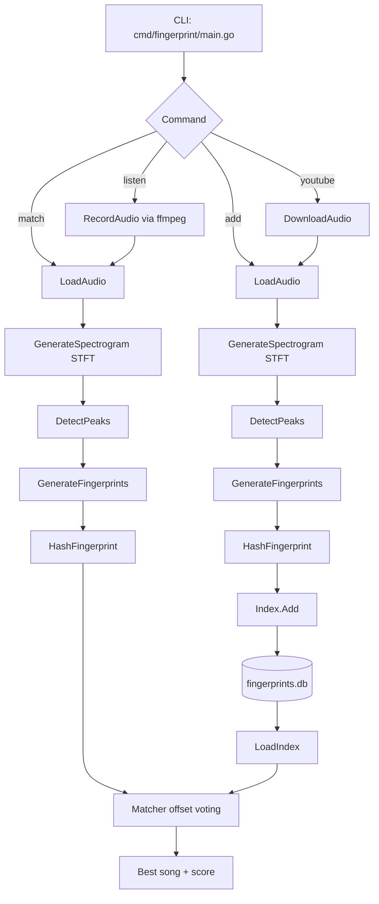

# EchoID

EchoID is a Go-based audio fingerprinting project (Shazam-style prototype) that can:

- index songs into a local fingerprint database,
- match an unknown audio clip against indexed songs,
- record a short clip from microphone and identify it,
- download audio from a YouTube URL and add it to the index.

It uses frequency peak pairing + hash matching with offset voting to identify songs.

---

## 1) What is this project?

EchoID is a command-line music identification engine.

At a high level, it converts audio into compact fingerprints and stores them in `fingerprints.db`. Later, when you pass another clip, it generates query fingerprints and searches for the best overlap with indexed songs.

### Core idea

For each audio file:

1. Convert audio to mono samples (`[]float64`).
2. Build a spectrogram using STFT.
3. Detect prominent spectral peaks.
4. Pair nearby peaks into fingerprints: `(f1, f2, Δt, anchorTime)`.
5. Hash `(f1, f2, Δt)` and store with song id + anchor time.

For matching:

- Generate query hashes,
- Look up hash collisions in database,
- Vote by time offset `(dbAnchor - queryAnchor)`,
- Song with strongest consistent offset wins.

---

## 2) How it works

### A) Audio loading

Implemented in `internal/audio`:

- WAV: decoded with `github.com/go-audio/wav`.
- MP3 / others: converted through `ffmpeg` to mono WAV then decoded.
- Optional microphone capture: `ffmpeg` pulse input (`-f pulse -i default`).

### B) Spectrogram generation

Implemented in `internal/spectogram/stft.go`:

- Window size: `2048`
- Hop size: `512`
- Hann window applied before FFT
- FFT via `gonum.org/v1/gonum/dsp/fourier`
- Uses first half of FFT, capped to lower useful bins

This produces a time-frequency matrix:

$$S[t, f] = |\text{FFT}(w \cdot x_t)|$$

### C) Peak detection

Implemented in `internal/peaks/peak.go`:

- Computes global magnitude threshold (75th percentile)
- Keeps local maxima in frequency neighborhood (±3 bins)

Each peak:

- `TimeIndex`
- `FreqIndex`
- `Magnitude`

### D) Fingerprint generation

Implemented in `internal/fingerprint/fingerprint.go`:

- Sort peaks by time
- For each anchor peak, pair with up to `fanOut = 3` subsequent peaks
- Ignore pairs with `deltaTime > 30`

Fingerprint structure:

- `Freq1`
- `Freq2`
- `DeltaTime`
- `AnchorTime`

Hash function (`internal/fingerprint/hash.go`) packs those into a `uint64`.

### E) Indexing and matching

Database (`internal/db/index.go`):

- In-memory map + gob persistence:
  - `map[hash][]Entry`
  - `Entry = { SongID, AnchorTime }`
- Saved to `fingerprints.db`

Matcher (`internal/matcher/matcher.go`):

- For each query fingerprint hash, fetch matching DB entries
- Vote by offset per song
- Score = max votes at a single offset
- Apply dynamic minimum threshold:

$$\text{minThreshold} = \max\left(10, \left\lfloor \frac{|Q|}{20} \right\rfloor\right)$$

where $|Q|$ is number of query fingerprints.

---

## 3) How to use

## Prerequisites

- Go (recommended: modern stable version)
- `ffmpeg` installed and available in PATH
- Linux audio stack for `listen` command (`pulse` input)

## Install dependencies

From project root:

```bash
go mod tidy
```

## Run commands

### Add / index a song

```bash
go run ./cmd/fingerprint add -file /path/to/song.mp3 -id song_name
```

Notes:

- `-file` is required.
- `-id` is the identifier stored in DB and shown during match.

### Match an audio clip

```bash
go run ./cmd/fingerprint match -file /path/to/query_clip.wav
```

Output example:

```text
match: song_name score: 87
```

### Record from microphone and match

```bash
go run ./cmd/fingerprint listen
```

Current default recording length in code: 10 seconds.

### Download from YouTube and index

```bash
go run ./cmd/fingerprint youtube -url "https://www.youtube.com/watch?v=..."
```

This downloads audio, fingerprints it, adds it to DB, then removes downloaded file.

---

## Database behavior

- If `fingerprints.db` exists, it is loaded and appended.
- If not, a new index is created.
- DB format uses Go `gob` serialization.

---

## 4) Folder structure

```text
.
├── cmd/
│   └── fingerprint/
│       ├── main.go                # CLI entrypoint: add/match/listen/youtube
│       └── temp/
│           ├── converted/         # temp conversion artifacts
│           └── downloaded/        # temp downloaded audio
├── internal/
│   ├── audio/
│   │   ├── loader.go              # wav/mp3 loading + ffmpeg conversion
│   │   ├── downloadYt.go          # YouTube audio download
│   │   └── recored.go             # microphone recording (ffmpeg)
│   ├── db/
│   │   └── index.go               # hash index + save/load (gob)
│   ├── fingerprint/
│   │   ├── fingerprint.go         # peak pairing to fingerprints
│   │   └── hash.go                # uint64 hash packing
│   ├── matcher/
│   │   └── matcher.go             # offset voting + threshold
│   ├── peaks/
│   │   ├── peak.go                # spectral peak detection
│   │   └── type.go                # peak/bin structs
│   └── spectogram/
│       └── stft.go                # STFT + Hann window
├── go.mod
├── go.sum
└── todo.md
```

---

## 5) Architecture diagram



---

## Example workflow

1. Add known songs:

```bash
go run ./cmd/fingerprint add -file ./songs/song1.mp3 -id song1
go run ./cmd/fingerprint add -file ./songs/song2.mp3 -id song2
```

2. Match an unknown clip:

```bash
go run ./cmd/fingerprint match -file ./samples/query.wav
```

3. Optional live recognition:

```bash
go run ./cmd/fingerprint listen
```

---

## Notes / current limitations

- Matching quality depends on clean audio and enough indexed material.
- Paths for temporary files should exist (`temp/downloaded`, `temp/converted`).
- `listen` currently assumes PulseAudio-compatible input (`default`).
- Spectrogram and threshold constants are currently hardcoded.

---

## Future improvements ideas

- Tune fingerprint parameters (`fanOut`, thresholds, FFT bins).
- Add confidence normalization and top-k match output.
- Support larger persistent storage backend.
- Improve metadata handling and duplicate song detection.
- Add tests + benchmark suite.

---

## License

No explicit license file is currently included. Add a `LICENSE` file if you want open-source distribution terms.
