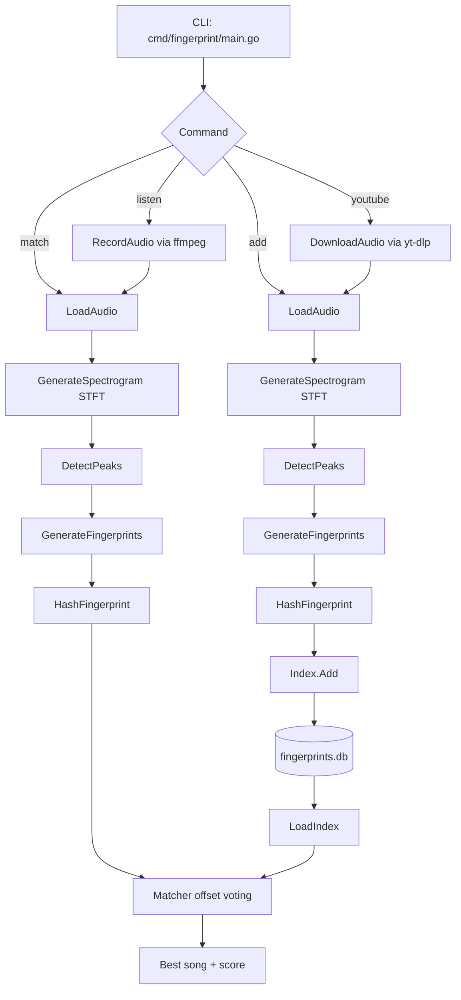

# EchoID

EchoID is a Go-based audio fingerprinting engine (Shazam-style prototype) that can:

- index songs into a local fingerprint database,
- match an unknown audio clip against indexed songs,
- record a short clip from microphone and identify it,
- download audio from a YouTube URL and add it to the index.

It uses spectral peak pairing + hash matching with offset voting to identify songs.

---

## 1) What is this project?

EchoID is a command-line music identification engine.

At a high level, it converts audio into compact fingerprints and stores them in a database. Later, when you pass another clip, it generates query fingerprints and searches for the best overlap with indexed songs.

### Core idea

For each audio file:

1. Convert audio to mono samples (`[]float64`).
2. Build a spectrogram using STFT.
3. Detect prominent spectral peaks.
4. Pair nearby peaks into fingerprints: `(f1, f2, Δt, anchorTime)`.
5. Hash `(f1, f2, Δt)` and store with song id + anchor time.

For matching:

- Generate query hashes,
- Look up hash collisions in database,
- Vote by time offset `(dbAnchor - queryAnchor)`,
- Song with strongest consistent offset wins.

---

## 2) How it works

### A) Audio loading

Implemented in `internal/audio`:

- WAV: decoded with `github.com/go-audio/wav`.
- MP3 / others: converted through `ffmpeg` to mono WAV then decoded.
- Microphone capture: `ffmpeg` pulse input (`-f pulse -i default`).
- YouTube: via `yt-dlp` subprocess with cookies + Deno JS runtime for extraction.

### B) Spectrogram generation

Implemented in `internal/spectrogram/stft.go`:

- Window size: `2048`
- Hop size: `512`
- Hann window applied before FFT
- FFT via `gonum.org/v1/gonum/dsp/fourier`
- Uses first half of FFT, capped to lower useful bins

This produces a time-frequency matrix:

$$S[t, f] = |\text{FFT}(w \cdot x_t)|$$

### C) Peak detection

Implemented in `internal/peaks/peak.go`:

- Computes global magnitude threshold (75th percentile)
- Keeps local maxima in frequency neighborhood (±3 bins)
- Maximum 8 peaks per time frame

Each peak:

- `TimeIndex`
- `FreqIndex`
- `Magnitude`

### D) Fingerprint generation

Implemented in `internal/fingerprint/fingerprint.go`:

- Sort peaks by time
- For each anchor peak, pair with up to `fanOut = 3` subsequent peaks
- Ignore pairs with `deltaTime > 30` frames

Fingerprint structure:

- `Freq1`
- `Freq2`
- `DeltaTime`
- `AnchorTime`

Hash function (`internal/fingerprint/hash.go`) packs those into a `uint64`.

### E) Indexing and matching

Database (`internal/db/index.go`):

- In-memory map + gob persistence:
  - `map[hash][]Entry`
  - `Entry = { SongID, AnchorTime }`
- Saved to file (default: `fingerprints.db`)

Matcher (`internal/matcher/matcher.go`):

- For each query fingerprint hash, fetch matching DB entries
- Vote by offset per song
- Score = max votes at a single offset
- Confidence check: top score must be ≥ 1.3× second-best
- Dynamic minimum threshold:

$$\text{minThreshold} = \max\left(10, \left\lfloor \frac{|Q|}{20} \right\rfloor\right)$$

where $|Q|$ is number of query fingerprints.

---

## 3) How to use

### Prerequisites

- Go 1.26+
- `ffmpeg` installed and available in PATH
- Linux audio stack for `listen` command (pulse input)
- `yt-dlp` for YouTube downloads (optional)

### Install dependencies

```bash
go mod tidy
```

### Build

```bash
make build
./bin/echoid --help
```

### Add / index a song

```bash
echoid add -file /path/to/song.mp3 -id song_name
```

- `-file` is required.
- `-id` is the identifier shown during match (defaults to filename if omitted).

### Match an audio clip

```bash
echoid match -file /path/to/query_clip.wav
```

Output example:

```
  Loading audio...
  Matching...
  Match: song_name (score: 87)
```

### Record from microphone and match

```bash
echoid listen
```

Records 10 seconds by default; use `-seconds` to change:

```bash
echoid listen -seconds 5
```

### Download from YouTube and index

```bash
echoid youtube -url "https://www.youtube.com/watch?v=..."
```

Downloads audio via `yt-dlp`, fingerprints it, adds it to the database, then cleans up the temp file.

---

## 4) Configuration

All paths can be overridden via environment variables:

| Variable | Default | Description |
|---|---|---|
| `ECHOID_DB_PATH` | `fingerprints.db` | Fingerprint database file |
| `ECHOID_TEMP_DIR` | `temp` | Temporary directory for audio processing |

---

## 5) Tests & benchmarks

```bash
make test       # go test -race -count=1 ./...  (27 tests)
make bench      # go test -bench=. -benchmem ./...
make vet        # go vet ./...
```

### Benchmark results (12th Gen i5-12450HX)

| Operation | Time | Allocs |
|---|---|---|
| `GenerateSpectrogram` (2s @ 44.1kHz) | ~6.6 ms | 348 |
| `DetectPeaks` (200×256 spectrogram) | ~2.2 ms | 1564 |
| `GenerateFingerprints` (500 peaks) | ~26 µs | 4 |
| `Match` (50 songs × 200 fps) | ~120 µs | 57 |
| `SaveLoad` (100 songs × 100 fps each) | ~1.4 ms | 10748 |

---

## 6) Folder structure

```text
.
├── .github/workflows/
│   └── ci.yml                        # GitHub Actions CI
├── cmd/
│   └── fingerprint/
│       └── main.go                   # CLI entrypoint: add/match/listen/youtube
├── internal/
│   ├── audio/
│   │   ├── loader.go                 # wav/mp3 loading + ffmpeg conversion
│   │   ├── downloadYt.go             # YouTube audio via yt-dlp
│   │   └── record.go                 # microphone recording (ffmpeg)
│   ├── config/
│   │   └── config.go                 # env-var configuration
│   ├── db/
│   │   ├── index.go                  # hash index + save/load (gob)
│   │   └── index_test.go
│   ├── fingerprint/
│   │   ├── fingerprint.go            # peak pairing to fingerprints
│   │   ├── fingerprint_test.go
│   │   ├── hash.go                   # uint64 hash packing
│   │   └── hash_test.go
│   ├── matcher/
│   │   ├── matcher.go                # offset voting + threshold
│   │   └── matcher_test.go
│   ├── peaks/
│   │   ├── peak.go                   # spectral peak detection
│   │   └── peak_test.go
│   └── spectrogram/
│       ├── stft.go                   # STFT + Hann window
│       └── stft_test.go
├── Dockerfile                        # Multi-stage Docker build
├── Makefile                          # build/test/bench/docker targets
├── go.mod
└── go.sum
```

---

## 7) Architecture diagram


```mermaid
flowchart TD
    A[CLI: cmd/fingerprint/main.go] --> B{Command}

    B -->|add| C[LoadAudio]
    B -->|match| D[LoadAudio]
    B -->|listen| E[RecordAudio via ffmpeg]
    E --> D
    B -->|youtube| F[DownloadAudio via yt-dlp]
    F --> C

    C --> G[GenerateSpectrogram STFT]
    D --> H[GenerateSpectrogram STFT]

    G --> I[DetectPeaks]
    H --> J[DetectPeaks]

    I --> K[GenerateFingerprints]
    J --> L[GenerateFingerprints]

    K --> M[HashFingerprint]
    M --> N[Index.Add]
    N --> O[(fingerprints.db)]

    O --> P[LoadIndex]
    L --> Q[HashFingerprint]
    Q --> R[Matcher offset voting]
    P --> R
    R --> S[Best song + score]
```

---

## 8) Example workflow

1. Add known songs:

```bash
go run ./cmd/fingerprint add -file ./songs/song1.mp3 -id "Song One"
go run ./cmd/fingerprint add -file ./songs/song2.mp3 -id "Song Two"
```

2. Match an unknown clip:

```bash
go run ./cmd/fingerprint match -file ./samples/query.wav
```

3. Optional live recognition:

```bash
go run ./cmd/fingerprint listen -seconds 5
```

---

## 9) Docker

```bash
make docker        # build image
docker run --rm echoid --help
```

Note: `youtube` subcommand won't work inside Docker unless `yt-dlp` is installed in the image.

---

## 10) Notes / current limitations

- Matching quality depends on clean audio and enough indexed material.
- Temporary directories (`temp/downloaded`, `temp/converted`) are created automatically.
- `listen` currently assumes PulseAudio-compatible input (`default`).
- YouTube downloads require `yt-dlp` with `--cookies-from-browser` — extract may fail without browser cookies + Deno JS runtime.
- Fingerprint parameters (`fanOut`, thresholds, FFT bins) are compile-time constants.

---

## 11) Future improvements

- Confidence normalization and top-k match output.
- Support larger persistent storage backend (e.g. SQLite).
- Improved metadata handling and duplicate song detection.
- Cross-platform audio recording support.
- Continuous listening mode with real-time matching.
- Web API / gRPC service wrapper.

---

