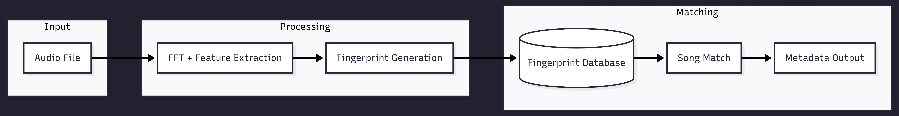

# EchoID

A command-line audio fingerprinting engine built in Go. Index songs, match unknown clips, record from mic, or pull audio from YouTube — all backed by spectral peak pairing and offset voting.

## How It Works

1. Load audio and convert to mono samples.
2. Build a spectrogram via STFT with a Hann window.
3. Detect prominent spectral peaks (local maxima in time-frequency space).
4. Pair nearby peaks into fingerprints: `(freq1, freq2, Δt, anchorTime)`.
5. Hash each fingerprint and store it with the song ID.
6. For matching: hash query fingerprints, find collisions in the database, vote by time offset — the song with the strongest consistent offset wins.

## Architecture



## Usage

### Prerequisites

- Go 1.26+
- `ffmpeg` in PATH
- `yt-dlp` (for YouTube downloads, optional)
- PulseAudio (for `listen` command on Linux)

### Build

```bash
make build
./bin/echoid --help
```

### Add a song to the index

```bash
echoid add -file /path/to/song.mp3 -id "song_name"
echoid add -file /path/to/song.mp3 -id "song_name" -artist "Artist" -album "Album"
```

### Match an audio clip

```bash
echoid match -file /path/to/query.wav
```

### Record from microphone and identify

```bash
echoid listen              # 10 seconds
echoid listen -seconds 5   # custom duration
```

### Download from YouTube and index

```bash
echoid youtube -url "https://www.youtube.com/watch?v=..."
```

## Configuration

| Variable | Default | Description |
|---|---|---|
| `ECHOID_DB_PATH` | `fingerprints.db` | Fingerprint database file |
| `ECHOID_TEMP_DIR` | `temp` | Temporary directory for audio processing |

## Tests

```bash
make test    # 27 tests with -race
make bench   # benchmarks
make vet     # go vet
```

### Benchmarks (12th Gen i5-12450HX)

| Operation | Time | Allocs |
|---|---|---|
| `GenerateSpectrogram` (2s @ 44.1kHz) | ~6.6 ms | 348 |
| `DetectPeaks` (200x256 spectrogram) | ~2.2 ms | 1564 |
| `GenerateFingerprints` (500 peaks) | ~26 us | 4 |
| `Match` (50 songs x 200 fps) | ~120 us | 57 |
| `SaveLoad` (100 songs x 100 fps each) | ~1.4 ms | 10748 |

## Docker

```bash
make docker
docker run --rm echoid --help
```

## Project Structure

```text
cmd/fingerprint/main.go       CLI entrypoint
internal/
  audio/                      WAV/MP3 loading, yt-dlp, mic recording
  config/                     env-var config
  db/                         hash index + gob persistence
  fingerprint/                peak pairing + hash packing
  matcher/                    offset voting + threshold matching
  output/                     terminal output formatting
  peaks/                      spectral peak detection
  spectrogram/                STFT + Hann window
```

## Limitations

- Matching quality depends on clean audio and sufficient indexed material.
- `listen` assumes PulseAudio input.
- YouTube downloads require `yt-dlp` with browser cookies and optionally Deno JS runtime.
- Fingerprint parameters are compile-time constants.

## Future Work

- Confidence normalization and top-k match output.
- SQLite or larger persistent storage backend.
- Improved metadata handling and duplicate detection.
- Cross-platform audio recording.
- Continuous listening mode with real-time matching.
- Web API / gRPC service wrapper.
